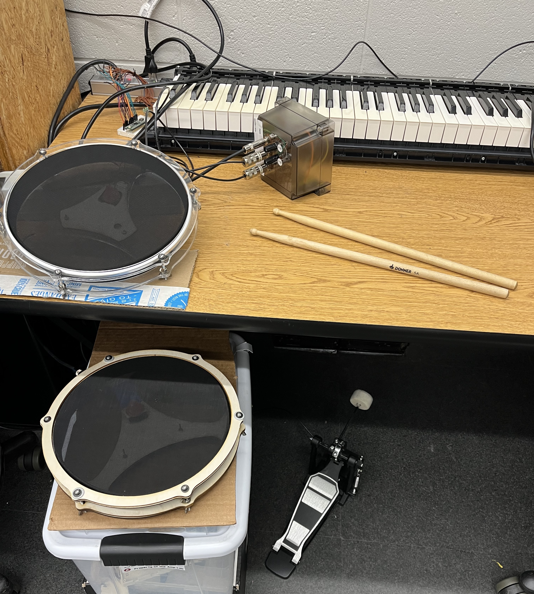

## Project Overview
This project aims to produce an electronic drum set that is silent yet feels nearly identical to a real acoustic drum set. I've split the project into two phases:
* Phase 1 - creating a basic kit with a kick drum trigger and 2 drum pads as a proof-of-concept **(completed)**
* Phase 2 - creating a full drum kit with kick trigger, 4 drum pads, and 4 electronic cymbals **(in progress)**

A summary of work is as follows:
### Drum Pads
* Finalize a choice of pad design
    * It'll likely be 3d printed pads - the laser cut pads don't quite have the same dimensions as real drums as laser cutting is limited to flat sheet materials
    * I'll probably use a similar design to [Open E-Drums](https://open-e-drums.com/hardware/download_pad_noshell.html)
* Figure out mounting hardware
    * Should I use a base or side mount for attaching to the drum rack?
    * Side mounts are cleaner but might wear out or shift position faster

### Cymbals
* Hi hats - probably best to get a real hi-hat stand

## Members
Ethan James, Computer Engineering Student (2024) -
ethanjamesauto@vt.edu

## Notes
[Pad_10inch.svg](Pad_10inch.svg) is used for both drums I've built.

The shells are built using [shell.scad](shell.scad)

## Images

## Links
* [Alesis drum clamp mount](https://www.printables.com/model/244788-alesis-electronic-drum-clamp-mount)